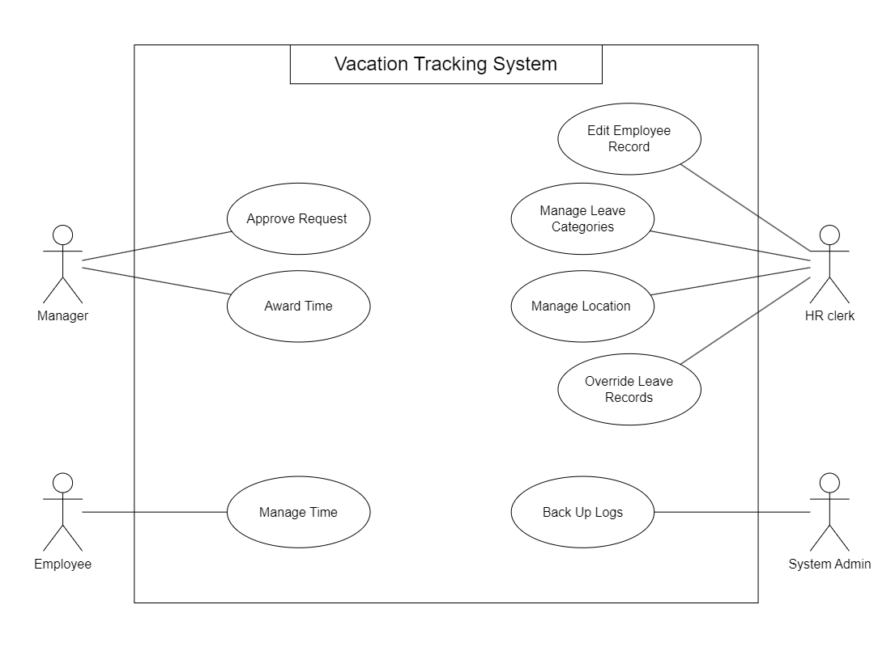

# Vacation Tracking System docs

## Index

- [**Vision**](#vision)
- [**Goals**](#goals)
- [**Domain**](#domain)
- [**Actors**](#actors)
- [**Use Cases**](#use-cases)
- [**Requirements**](#requirements)
  - [Functional Requirements](#functional-requirements)
  - [Non-Functional Requirements](#non-function-requirements)
  - [Constraints ](#constraints)

---

## Vision
> Develop an intuitive and user-friendly system that allows employees to manage their vacation time, sick leave, and personal time off independently, reducing HR involvement and streamlining the overall leave management process.

## Goals
> Improve the organization's internal business processes by reducing the time, effort, and costs associated with managing vacation and leave requests, with a focus on minimizing HR workload and enhancing process efficiency.

## Domain
> The domain centers on the management of employee leave, addressing the inefficiencies of manual processes. Key challenges include ensuring compliance with company policies and employee-specific regulations, streamlining the approval workflow without disrupting business operations, and mitigating workforce shortages in critical positions. Manual tracking often causes delays, miscommunication, and operational bottlenecks, emphasizing the need for an automated solution to enhance accuracy, efficiency, and overall productivity.

## Actors

1. **Employee**: Uses the system to manage their vacation time.
2. **Manager**: Has the same abilities as an employee but can approve vacation requests for subordinates and award compensatory time within system limits.
3. **Clerk**: A member of HR with rights to view, add, or remove employee records and ensure data accuracy across HR systems. If also an employee, they use separate login IDs for HR and employee roles.
4. **System Admin**: Ensures the system runs smoothly, manages technical resources (e.g., web server, database), and archives log files.

## Use Cases
The main use cases are as follows.

- [**Manage Time**](./use-cases/manage-time.md): Describes how employees request and view vacation time 
requests.

- [**Approve Request**](./use-cases/approve-request.md): Describes how a manager responds to a subordinate’s request for vacation time. 

- [**Award Time**](./use-cases/award-time.md): Describes how a manager can award a subordinate extra 
leave time (comp time).

- [**Edit Employee Record**](./use-cases/edit-employee-record.md): Describes how an HR clerk edits an employee’s
information in the system. This includes setting all the leave time allow￾ances and the maximum time that can be awarded by the manager.

- [**Manage Locations**](./use-cases/manage-locations.md): Describes how an HR clerk manages location 
records and their rules.

- [**Manage Leave Categories**](./use-cases/manage_leave_categories.md): Describes how an HR clerk manages
leave categories and their rules.

- [**Override Leave Records**](./use-cases/override-leave-records.md): Describes how an HR clerk may override 
any rejection of leave time requests made by the rules in the system.

- [**Back Up System Logs**](./use-cases/back-up-system-logs.md): Describes how the system administrator backs
up the system’s logs. 

| 
| --------------------------------------------------------------- |
| **Use Case Model** |

## Requirements 

### Functional Requirements
1. Vacation Management 
	- Implement a rules-based system to validate and verify vacation and leave requests.
	- Allow employees to submit vacation requests up to 1.5 years in advance.
	- Provide access to vacation request history for the previous calendar year.
2. Approval Workflow
	- Enable manager approval.
	- Notify manager via email of pending approval request.
	- Notify employees via email of changes to their request status.
3. Integration
	- Ensure seamless integration with existing hardware and software systems.
	- Leverage the organization's SSO portal for secure authentication.
4.  Logging and Overrides
	- Maintain activity logs for all transactions to ensure traceability.
	- Allow HR and system administrator to override actions, with all the overrides logged.
5. HR Flexibility
	- Enable HR to set and modify constraints on vacation requests.
	- Allow managers to award additional personal leave time within system defined limits.
### Non-Functional Requirements
- **Useability**: The system must be intuitive, easy to navigate, and require minimal training for users.
- **Portability**: The system should function effectively on the organization's existing hardware.
- **Compatibility**: Integrate with the current HR system to retrieve and update employee data seamlessly.
- **Security**: Ensure secure authentication and data privacy through encryption and access control.
- **Availability**: Provide 24/7 access with minimal downtime.
- **Accountability**: Log all transactions and system actions to ensure transparency and auditability.

### Constraints 
- The system must integrate with existing HR systems for employee data synchronization.
- All features must comply with the organization's IT infrastructure and policies.
